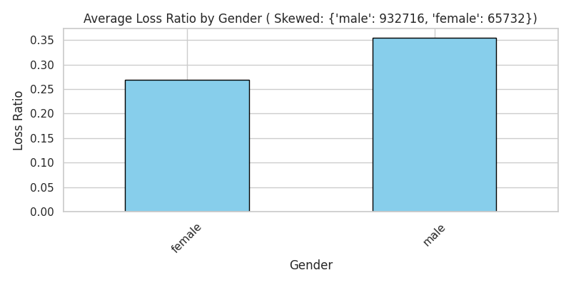
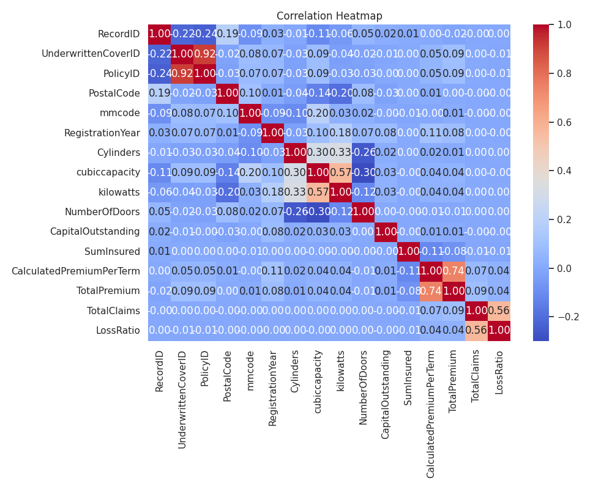

# Insurance Risk Analytics & Predictive Modeling for ACIS

This project explores and models risk and profitability in insurance data using Exploratory Data Analysis (EDA), statistical reasoning, and version-controlled workflows with DVC (Data Version Control).

##  Task 1: Exploratory Data Analysis (EDA)

###  Objective
Gain a foundational understanding of the insurance dataset, assess data quality, and uncover patterns in customer risk and profitability.

###  EDA Steps Performed
- **Data Summarization**: Info, descriptive stats
- **Missing Value Analysis**: Visual and tabular inspection
- **Univariate & Bivariate Analysis**:
  - Distribution plots for key numerical and categorical variables
  - Loss Ratio calculated as `TotalClaims / TotalPremium`
  - Segmented Loss Ratio by Province, Gender, and Vehicle Type
- **Temporal Trends**:
  - Monthly trends in claims and premiums over an 18-month period
- **Vehicle Risk**:
  - Top 10 vehicle makes and models by total claims
- **Outlier Detection**:
  - Boxplots for TotalClaims, TotalPremium, and CustomValueEstimate
- **Geographic Analysis**:
  - Loss Ratio by Postal Code (Zip Code)
- **Skewness Review**:
  - Distribution skewness for financial fields

All EDA plots are saved under the `plots/` directory.

---

## Task 2: Data Versioning with DVC

###  Objective
Ensure reproducibility and traceability of the modeling pipeline through version control for datasets using **DVC (Data Version Control)**.

###  Key Steps Completed

-  Initialized DVC (`dvc init`)
-  Created and configured a local DVC remote (`~/dvc-storage`)
-  Tracked cleaned dataset:  
  `data/cleaned_machineLearningRating.csv`
-  Generated and committed `.dvc` file to Git
-  Updated `.gitignore` to exclude raw data and include `.dvc` metadata
-  Pushed actual dataset to DVC remote using:  
  `dvc push`

 This setup ensures any future modeling tasks are backed by version-controlled data with full reproducibility.

---

##  Next Step

We are now ready for **Task 3: Predictive Modeling**  
(See branch `task-3` for modeling pipelines.)

---

## Project Structure Overview
'''

Insurance-Risk-Analytics---Predictive-Modeling-for-ACIS/
│
├── .dvc/                          # DVC config & metadata
├── data/                          # Raw and cleaned datasets
│   ├── cleaned_machineLearningRating.csv
│   ├── cleaned_machineLearningRating.csv.dvc
│   └── machineLearningRating_v3.txt
│
├── notebooks/                     # Jupyter notebooks
│   ├── eda.ipynb                  # Task 1 EDA notebook
│   └── import_clean.ipynb        # Data import and cleaning
│
├── plots/                         # All saved plots grouped by type
│   ├── bivariate/
│   ├── geography/
│   ├── multivariate/
│   ├── outliers/
│   ├── time/
│   ├── univariate/
│   └── vehicle_risks/
│
├── reports/                       # For generated reports (optional)
│
├── src/                           # Modular Python scripts
│   ├── __init__.py
│   ├── data_load.py               # Load and clean data
│   ├── eda.py                     # EDA functions
│   └── utils.py                   # Reusable helpers/utilities
│
├── tests/                         # Placeholder for unit tests
│
├── .dvcignore                     # Ignore files from DVC
├── .gitignore                    # Ignore files from Git
├── LICENSE
├── README.md                     # Project overview and documentation
└── requirements.txt              # Python dependencies
'''

## sample outputs
'''

'''
