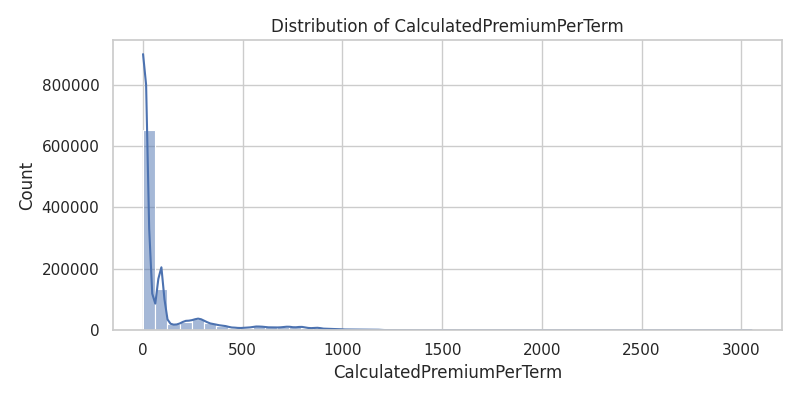
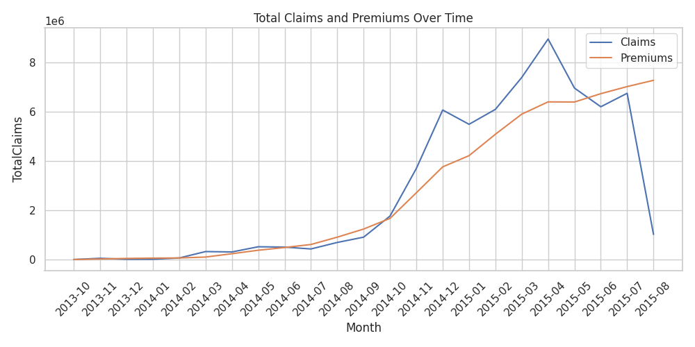

#  Insurance Risk Analytics & Predictive Modeling for ACIS

This project explores and models risk and profitability in insurance data using statistical reasoning, EDA, version control with DVC, and machine learning techniques. It forms the foundation for a **data-driven, risk-based premium pricing system**.

---

##  Project Objective

To analyze insurance policy and claims data to:
- Understand customer risk and claim patterns (EDA)
- Quantify risk using loss ratio and other metrics
- Statistically validate segmentation hypotheses
- Predict claim severity, claim occurrence, and optimize premiums
- Enable transparency using explainable ML (SHAP)

---

##  Project Structure

```

Insurance-Risk-Analytics---Predictive-Modeling-for-ACIS/
├── data/                         # Raw & processed datasets (DVC-managed)
│   ├── machineLearningRating_v3.txt
│   ├── cleaned_machineLearningRating.csv
│   ├── processed_for_modeling.csv
│   └── cleaned_machineLearningRating.csv.dvc
├── src/                          # Modularized Python code
│   ├── data_load.py              # Load & clean dataset
│   ├── eda.py                    # EDA functions & plots
│   └── __init__.py                 # Reusable helpers
├── notebooks/                    # Jupyter notebooks
│   ├── import_clean.ipynb        # Cleaning stage
│   ├── eda.ipynb                 # EDA & visual insights
│   ├── task3\_hypothesis.ipynb    # A/B Hypothesis Testing
│   └── task4\_modeling.ipynb      # Predictive Modeling
|   ├── plots/                        # Saved plots (grouped by type)
|    │   ├── univariate/
|    │   ├── bivariate/
|    │   ├── multivariate/
|    │   ├── time/
|    │   ├── outliers/
|    │   ├── geography/
|    │   └── vehicle_risks/
|    ├── saved_models/                      
|    │   ├── randomforest_best_model.pkl
|    │   ├── scaler.pkl
|    │   ├── sgb_claim_occured_model.pkl
|    │   ├── xgboost_severity_model.pkl
|
├── APP.PY
├── .gitignore
├── .dvcignore
├── README.md
├── LICENSE
└── requirements.txt

````

---

##  Task 1: Exploratory Data Analysis (EDA)

### Objectives
- Understand insurance risk patterns
- Assess data quality and completeness
- Explore geographic and demographic patterns

### Key Analyses Performed
- **Data Summarization**: Descriptive statistics, data types, skewness
- **Missing Value Assessment**: Titles used to infer missing `Gender` and `MaritalStatus`
- **Feature Engineering**: Created `LossRatio = TotalClaims / TotalPremium`
- **Univariate & Bivariate Analysis**: Histograms, bar charts, segmented loss ratios
- **Temporal Trends**: 18-month premium/claim patterns
- **Outlier Detection**: Boxplots of financial metrics
- **Top Risky Vehicles**: Highest claim `make` and `model`
- **Loss Ratio by Zip Code**: Geographic risk mapping

All visualizations are saved under `plots/`.

---

##  Task 2: Data Versioning with DVC

### Purpose
Enable reproducible data pipelines with **version-controlled datasets**.

### DVC Workflow Completed:
- `dvc init` initialized in repo
- Created a local remote: `~/dvc-storage`
- Tracked cleaned dataset:  
  `dvc add data/cleaned_machineLearningRating.csv`
- Committed `.dvc` files and `.gitignore` updates
- `dvc push` successfully pushed to local remote

 This guarantees **traceability**, **reproducibility**, and **collaboration readiness**.

---

##  Task 3: A/B Hypothesis Testing

**Goal**: Statistically validate risk & margin segmentation hypotheses.

| Hypothesis # | Null Hypothesis                                                             | Result              |
|--------------|-----------------------------------------------------------------------------|---------------------|
| H₀₁          | No risk difference across Provinces                                        |  Rejected          |
| H₀₂          | No risk difference across Zip Codes                                        |  Rejected          |
| H₀₃          | No margin difference across Zip Codes                                      |  Rejected          |
| H₀₄          | No risk difference between Genders                                         |  Failed to Reject  |
| Tracking Device | No risk difference due to Tracking Device                              |  Failed to Reject  |
| NewVehicle     | No risk difference between New vs Old vehicles                          |  Rejected          |

- **Tests Used**: Chi-squared, ANOVA, Z-test (for proportions)
- **KPIs**: Claim Frequency, Claim Severity, Profit Margin

---

##  Task 4: Predictive Modeling

###  1. Claim Severity Model (Regression)
- **Target**: `TotalClaims` for rows where `TotalClaims > 0`
- **Models**: Linear Regression, Decision Tree, Random Forest, XGBoost
- **Best Performance**:  
  - **XGBoost**: RMSE = ~14,257, R² = ~0.87

### 2. Claim Probability Classifier (Binary Classification)
- **Target**: Whether a claim occurred
- **Metrics**: Accuracy, Precision, Recall, F1-score, ROC AUC
- **Best Model**:  
  - **XGBoost**: ROC AUC = 0.901

### SHAP (Explainability)
- SHAP used to interpret XGBoost outputs for:
  - Claim Severity Regression
  - Claim Classification (Probability)
- **Top Drivers Identified**: `make`, `VehicleType`, `Province`, `SumInsured`, etc.

---

## Key Learnings & Business Value

- Provinces & Zip Codes show **significant risk variation** → segment pricing by geography
- Some vehicle types/models are **disproportionately risky**
- XGBoost consistently performs best, but business interpretability must be balanced
- SHAP explanations provide **model transparency** → crucial for insurance

---

##  Next Steps

- Tune models with cross-validation & hyperparameter optimization
- Integrate into Streamlit dashboard (Task 5 - Optional Bonus)
- Deploy risk-based pricing system to provide fair premiums


##  Sample Outputs






---

##  Dependencies

Install required packages:
```bash
pip install -r requirements.txt
````

---

##  Author

* Nurye Nigus
* Project: **Insurance Risk Analytics & Modeling for ACIS**

---


